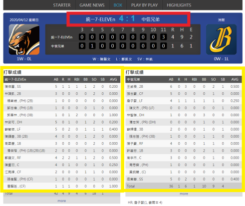

# Project_CPBLData
Collect CPBL(中華職棒) batting start lineups data and visualize the information.

## Goal
  This project is motivated by a post on PTT forum on baseball discussion titled “Who is the worst batting fourth player in CPBL?”. [閒聊] 中職史上最爛的第四棒是誰? As a baseball fan, this question sparked my interests and motivated me to find out the answers. 
With some effort, all the batting starting lineups players’ scores are collected in these 30 years & 7840 games, and store into database and shown on a simple statics website. We can easily retrieve the batting sores on which batting order that we needed and order it by the parameters that we want. If you try to go further on single player’s score, this website can meet demand.

## ETL Pipeline Overview

Steps in the Data Pipeline:
1.	Python scripts retrieve data from CPBL website via crawler and stores the data in a relational MySQL database.
2.	SQL scripts then transform the data into a star schema, and arrange the data into some meaningful tables. Eventually, all the tables were stored into data warehouse (using AWS RDS in this project).
3.	Plotly Dashboard is used to retrieve data from database and visualize the data by using user interface on HEROKU.

## The Process
#### 1. Retrieve data from CPBL website

I wrote a website crawler in Python to retrieve data which include the final batting scores of starting lineups and the final results of every game from 1990 to 2020.

a.	`match_game_crawler.py`:
The main function of this script is to retrieve all the game dates and IDs which were filled into the URLs. Each URL contains all the batting information of each game, so gathering all the game dates and id is essential.

b.	`batting_data_crawler.py`:
By collected URLs, we can easily have every match’s final results and every batting starting lineups player’ scores. All the data were collected into dataframe, and stored into database.

#### 2.	Transforming and Loading the data
Now that the CPBL data is stored in a MySQL database and the next step is to transform the data into a star schema. All the tables are created on MySQL and the transformation are done in SQL. The SQL scripts are shown below:

a.	`rowdata_to_starschema.sql`:
This SQL script is mainly doing the basic jobs for next two steps. Load the row data into database, clean the data and finally create a star schema table. 

b.	`scoretables_for_players.sql`:
There are two tables are created in this script. 
StaticsScore: StaticsScore is grouped by year, batting and name. Therefore, each player’s batting scores in every year can be known. 
statplayscore: Statplayscore is grouped by batting and name. This table mainly shows all the batting scores of his whole player life.

c.	`winning_ratio_of_player.sql`:
There are three tables are created. 
countstarline: Countstarline shows the times he has to be on the batting starting lineup and.
winningstarline: Winningstarline shows the winning times that the team won the game when the player was on the batting starting lineup. 
winingratio: Winingratio shows the winning ratio when a player on the starting lineup.

